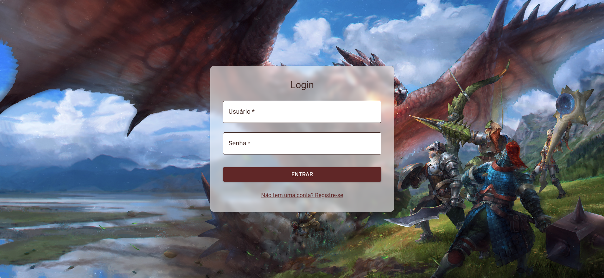

## 💻 Monster Hunter — Projeto FullStack

Aplicação web FullStack para gerenciamento de todos os componentes do jogo, com foco em CRUD completo, validação, segurança, performance e integração com API externa.
Projeto desenvolvido para fins educacionais, com o objetivo de praticar arquitetura de 3 camadas (Front-End | Back-End (API) | Banco de Dados) e aplicar boas práticas de segurança e qualidade no desenvolvimento de sistemas web.

**🎯 Objetivo do Projeto**

O projeto tem como foco o gerenciamento de informações e componentes relacionados ao universo do jogo Monster Hunter. Foi desenvolvida uma aplicação completa, permitindo o cadastro, visualização, atualização e exclusão de dados, integrando Front-End, Back-End e Banco de Dados com autenticação segura e otimizações de desempenho.

**🖋️ Arquitetura do Sistema**

A aplicação foi construída seguindo o modelo de Arquitetura em 3 Camadas:
Front-End — Interface de interação com o usuário.
Back-End — Camada da API REST.
Banco de Dados — Armazenamento de dados.
Além disso, o projeto utiliza Redis para cache e otimização de consultas, garantindo melhor desempenho e escalabilidade.

**🗂️ Requisitos Implementados e Medidas de Segurança**

O sistema foi desenvolvido com foco em segurança e qualidade, incluindo:
Verificação e Validação de Campos – Implementada com express-validator.
Proteção contra vulnerabilidades (XSS) – Utilização do helmet.
Prevenção de Ataques Automatizados – RateLimiter configurado para 100 requisições por IP a cada 15 minutos.
Registro e Monitoramento de Logs – Implementação de Winston para observabilidade.
Compressão de Respostas HTTP – Middleware compression para melhor desempenho.
Conexão Segura (HTTPS) – Configuração com certificados SSL.
Cache com Redis – Acelera respostas e reduz carga no banco.
Pool de Conexões com Mongoose – Melhora o gerenciamento e desempenho das conexões com o banco de dados.

**🤖 Tecnologias Utilizadas**

Front-End: React, React Router DOM, Material UI (MUI), Emotion (Styled e React), Testing Library (React e User Event), Web Vitals
Back-End: Express, Mongoose, MongoDB, Helmet, Express-Validator, Compression, CORS, Body-Parser, Dotenv, JWT, BCryptJS, Express-Rate-Limit, Redis, Winston, HTTPS

**🌏 API Externa**

O projeto integra a API externa [Monster Hunter World Database API](https://docs.mhw-db.com/), que fornece todas as informações sobre os componentes e elementos do universo do jogo.

---

**📸 Print da Aplicação**

